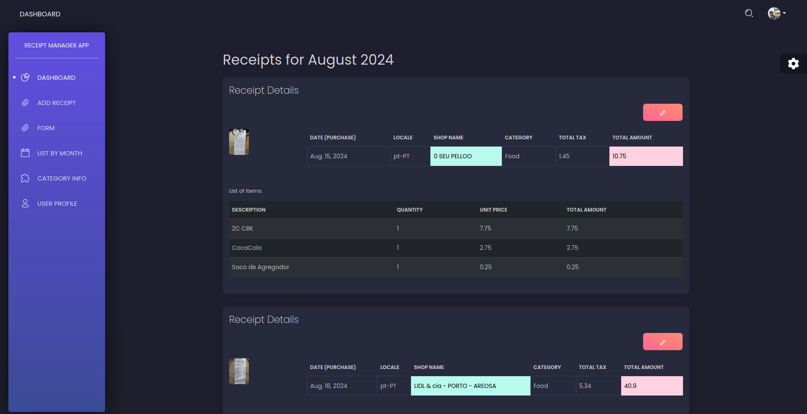
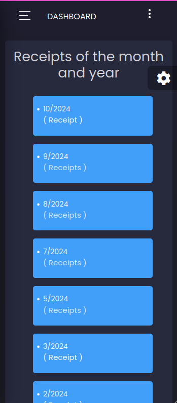
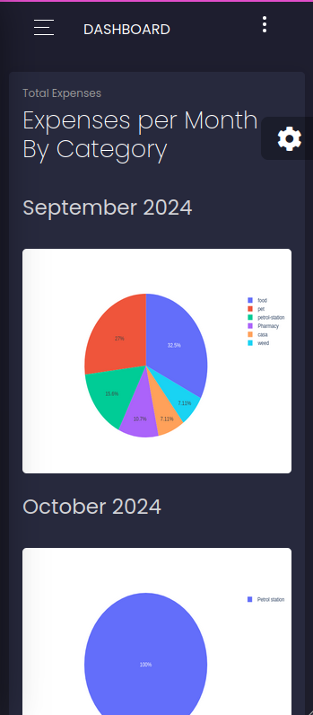

# Receipt Control App - Django and Mindee Integration - OCR

# 🗨️ Overview

* Receipt Control App is a Django-based project that helps users track their spending by scanning receipts using the [Mindee API](https://www.mindee.com/). The application categorizes expenses and provides monthly comparisons, helping users understand their spending habits in areas such as groceries, restaurants, and fuel stations.

    _Example of payment receipt and data capture_

# ❤️ Support and Motivation

Receipt Control App is free for everyone to use, and your support is highly appreciated. If you find the project useful, leaving a star ⭐ on the repository helps motivate the creator to keep improving and expanding the app. Every contribution, no matter how small, makes a difference!

# 📚 Receipt Control App Documentation

## Table of Contents

1. Overview
2. Prerequisites
3. Installation
4. Configuration
5. Usage
6. Contributing
7. FAQ
8. License
9. Some images of the project

# 💻 Prerequisites

To run this project locally, you’ll need:
- Python 3.x
- Django
- A Mindee account (free tier is sufficient)
- Redis

# 🧑‍💻️ Installation

### Redis and Celery Setup

To use Celery in this project, you need to have Redis installed as it acts as a message broker for Celery tasks. Here's how to get started:

**Installing Redis**

**For Ubuntu/Debian:**

    sudo apt update
    sudo apt install redis-server

**For macOS (using Homebrew):**
  
    brew install redis

**For Windows: You can use Redis for Windows or run Redis in a Docker container.**

    Follow the link to download redis for windows
    https://github.com/microsoftarchive/redis/releases

**You can check if Redis is running with:**
   
    redis-cli ping

You should see PONG if Redis is running correctly.

   
**After installation, start the Redis server:**

    sudo service redis-server start

**Get redis running**

With the project still running, open another terminal for the project and get redis working with the command

    celery -A core worker --loglevel=INFO

# 🧠️ Configuration

**Clone the repository:**
   
    git clone https://github.com/cristianosch/receipt-control-app.git
    cd receipt-control-app

**Create a virtual environment and activate it:**

    python -m venv venv
    source venv/bin/activate  # For Windows: venv\Scripts\activate

**Install dependencies:**

    pip install -r requirements.txt

**Set up your environment variables: Create a .env file in the root of your project and add your Mindee API key:**

    MINDEE_API_KEY=your-mindee-api-key

## Edit settings.py:

**Set the SECRET_KEY:**

    SECRET_KEY = 'your-secret-key'  # Add a key here for your project EX. '$d6%u-0b2yym)nqvd#^jxk@ctkd2i*boz<42*kz!tbivh9&-c0'

**Comment out the ALLOWED_HOSTS line, DEBUG and CSRF_TRUSTED_ORIGINS. Uncomment the lines for local ALLOWED_HOSTS line and DEBUG=True:**

    #ALLOWED_HOSTS = ['https://cristianodev.com']
    #DEBUG = os.getenv('DEBUG')
    #CSRF_TRUSTED_ORIGINS
    ALLOWED_HOSTS = []
    DEBUG = True

**In the Database section, comment the production database settings and uncomment the SQLite settings:**

    '''
    DATABASES = {
        'default': {
            'ENGINE': os.getenv('ENGINE'),
            'NAME': os.getenv('NAME'),
            'USER': os.getenv('USER'),
            'PASSWORD': os.getenv('PASSWORD'),
            'HOST': os.getenv('HOST'),
            'PORT': os.getenv('PORT')
        }
    }
    '''
    DATABASES = {
        'default': {
            'ENGINE': 'django.db.backends.sqlite3',
            'NAME': BASE_DIR / 'db.sqlite3',
        }
    }

**Comment out the STATICFILES_DIRS line.**
  
    #STATICFILES_DIRS = (os.path.join(BASE_DIR, 'receipt/static'),)

**Comment out the CELERY_BROKER_URL line and uncomment the line for local Redis:**

    #CELERY_BROKER_URL = os.getenv('CELERY_BROKER_URL')
    CELERY_BROKER_URL = 'redis://localhost:6379/0'

## Update the database

**Apply migrations:**
   
    python manage.py migrate

**Run the development server:**

    python manage.py runserver localhost:8000

**Open your browser and go to http://localhost:8000/ to start using Receipt Tracker.**

## Redis and Celery

For background task processing, make sure you have Redis installed and running. Here’s how to install Redis on Ubuntu:

    sudo apt update
    sudo apt install redis-server

**You can check if Redis is running with:**
   
    redis-cli ping

You should see PONG if Redis is running correctly.

**To start the Redis server, run:**

    sudo service redis-server start

# 🗓️ Usage

Once the application is running, you can:

  * Upload a photo of a receipt to automatically extract data.
  * View spending trends and monthly comparisons.
  * Categorize and analyze your expenses.

### Uploading a Receipt

1. Navigate to the upload section.
2. Select a photo of your receipt.
3. Click "Submit" to process the receipt.
   
### Viewing Reports

    * Go to the dashboard to see your spending categorized by type (groceries, restaurants, etc.).
    * Explore monthly reports to compare your expenses over time.
  
# 📫 Contributing to RECEIPT-CONTROL-APP

To contribute to <RECEIPT-CONTROL-APP>, follow these steps:

1. Fork this repository.
2. Create a branch: `git checkout -b <branch_name>`.
3. Make your changes and commit them: `git commit -m '<commit_message>'`
4. Push to the original branch: `git push origin <branch_name>`
5. Create the pull request.

**Please refer to the Contributing Guidelines for more details.**

Alternatively, see GitHub's documentation on [how to create a pull request](https://help.github.com/en/github/collaborating-with-issues-and-pull-requests/creating-a-pull-request).

# FAQ

### Q: How do I report a bug?
A: Please use the issue tracker to report any bugs you encounter.

### Q: Can I use the app on mobile devices?
A: Yes, the app is designed to be responsive and can be accessed on mobile devices through a web browser.

### Q: How do I add a new feature?
A: Feel free to suggest new features in the discussions or create a pull request with your implementation.

# License

**This project is licensed under the GNU GPL v3. See the LICENSE file for more details.**

# Some images of the project

    Main Dahsboard
 
    Details abstracted from receipts
 
    Responsive
 
    Receipts organized by months
 
    Graph with visual demonstration of expenses divided by category

