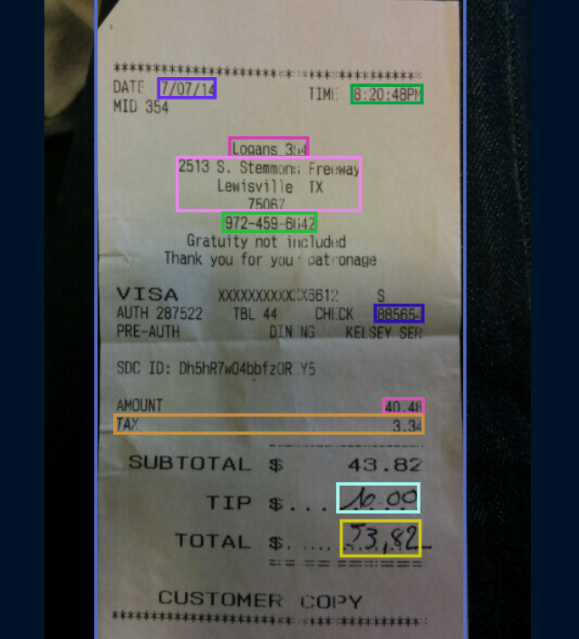
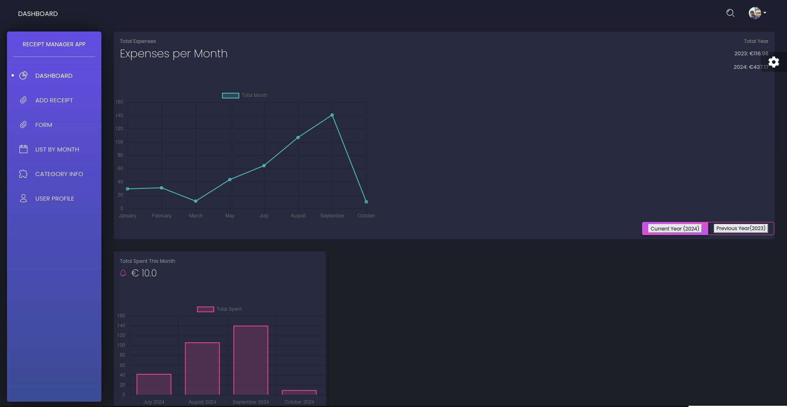
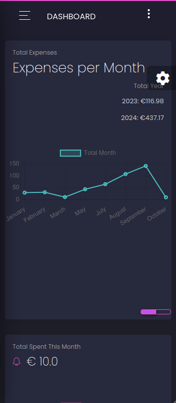

# Receipt Control App - Django and Mindee Integration

    Example of payment receipt and data capture

## Overview

Receipt Control App is a Django-based project that helps users track their spending by scanning receipts using the [Mindee API](https://www.mindee.com/). This tool categorizes expenses and provides monthly comparisons of spending in areas like groceries, restaurants, and fuel stations.

## Features
- Upload a photo of a receipt, and the data will be automatically processed.
- Compare expenses month-over-month.
- Categorize spending by merchant type (e.g., supermarkets, restaurants, gas stations).
- Visualize spending trends with easy-to-read statistics and charts.

## Getting Started

### 💻 Prerequisites

To run this project locally, you’ll need:
- Python 3.x
- Django
- A Mindee account (free tier is sufficient)

### Installation

1. Clone the repository:
   
    git clone https://github.com/cristianosch/receipt-control-app.git
    cd receipt-control-app

2. Create a virtual environment and activate it:
   
    python -m venv venv
    source venv/bin/activate  # For Windows: venv\Scripts\activate

3. Install dependencies:

    pip install -r requirements.txt

4. Set up your environment variables: Create a .env file in the root of your project and add your Mindee API key:

    MINDEE_API_KEY=your-mindee-api-key

5. Apply migrations: 
   
   python manage.py migrate

6. Run the development server:  

    python manage.py runserver

7. Open your browser and go to http://127.0.0.1:8000/ to start using Receipt Tracker.
   

### Adjustments and improvements

The project is still under development and the next updates will focus on the following tasks:

- [x] Creating models for the database
- [x] Preparing templates
- [x] Preparing the scenario for accepting the upload or photograph, and abstracting the data to the database
- [x] Sort receipts by month of purchase
- [x] Creating tables with receipt information
- [x] Create logic to compare costs between months and years
- [x] User creation / login / register
  
## 📫 Contribuindo para RECEIPT-CONTROL-APP

Para contribuir com <RECEIPT-CONTROL-APP>, siga estas etapas:

1. Bifurque este repositório.
2. Crie um branch: `git checkout -b <nome_branch>`.
3. Faça suas alterações e confirme-as: `git commit -m '<mensagem_commit>'`
4. Envie para o branch original: `git push origin <RECEIPT-CONTROL-APP> / <local>`
5. Crie a solicitação de pull.

Como alternativa, consulte a documentação do GitHub em [como criar uma solicitação pull](https://help.github.com/en/github/collaborating-with-issues-and-pull-requests/creating-a-pull-request).

    
    

